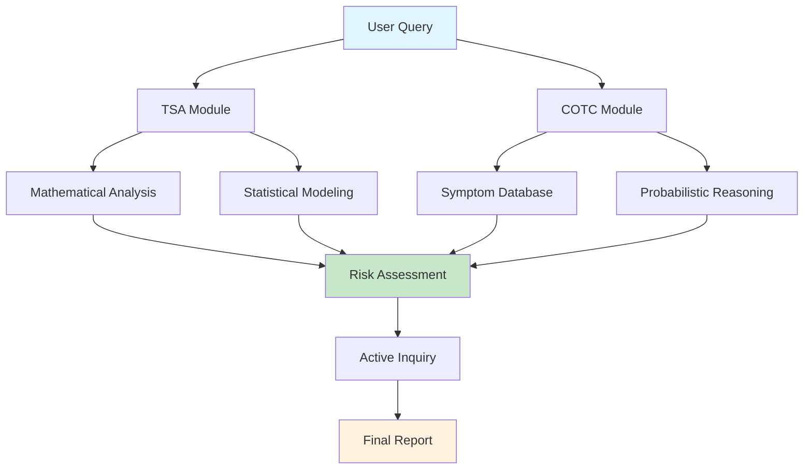

# COTCAgent: Preventive Consultation via Probabilistic Chain-of-Thought Completion

[](https://opensource.org/licenses/MIT)
[](https://www.python.org/downloads/)

A comprehensive AI-powered medical diagnostic system that integrates advanced mathematical modeling with probabilistic reasoning for systematic risk stratification and interpretable diagnostic assistance.

## 🚀 Key Features

### ✨ Core Capabilities
- **🔬 Advanced Temporal Analysis**: Multi-scale trend analysis, Bayesian change point detection, and anomaly detection
- **🧠 Chain-of-Thought Reasoning**: Probabilistic medical reasoning with 23K+ medical entities
- **📊 Risk Stratification**: Systematic disease risk assessment with uncertainty quantification
- **🔄 Interactive Diagnosis**: Proactive consultation through targeted question generation
- **🛡️ Enterprise Security**: Input validation, API protection, and sensitive data handling

### 📈 Performance Highlights
| Metric | COTCAgent | TimeCAP | Google KARE | DirPred |
|--------|-----------|---------|-------------|---------|
| **Accuracy** | **89.2%** | 77.9% | 80.2% | 83.5% |
| **F1-Score** | **85.7%** | 73.5% | 76.5% | 79.8% |
| **Top-2 Accuracy** | **91.5%** | 82.3% | 84.9% | 89.2% |

## 🏗️ Architecture



### Three-Phase Framework
1. **Time Series Analysis (TSA)**: Converts clinical queries into mathematical temporal analyses
2. **Chain-of-Thought Completion (COTC)**: Probabilistic reasoning with medical knowledge base
3. **Proactive Consultation**: Iterative diagnostic reasoning and question generation

## 📦 Installation

### Prerequisites
- Python 3.8+
- pip package manager

### Quick Start
```bash
# Clone repository
git clone <repository-url>
cd COTCAgent

# Install dependencies
pip install -r requirements.txt

# Configure API keys (⚠️ NEVER commit real keys to version control)
export DEEPSEEK_API_KEY="sk-your-actual-api-key-here"
export DEEPSEEK_API_BASE="https://api.deepseek.com/v1/chat/completions"

# Alternative: Use config file (recommended for production)
# Create config.json with your API credentials
# See config_manager.py for detailed configuration options

# Run tests
python tests/run_tests.py

# Start the API server
python backend_api.py
```

### ⚠️ Security Setup
Before running, ensure you have configured your API keys securely. See the [Security & Compliance](#-security--compliance) section below for detailed instructions.

## 🔧 Usage

### Basic Usage
```python
from cotc_agent import COTCAgent
from config import DeepSeekConfig

# Configure API (⚠️ Use environment variables or config file in production)
config = DeepSeekConfig(
    api_key='sk-your-actual-api-key-here',  # Never hardcode in source code
    api_base='https://api.deepseek.com/v1/chat/completions',
    model='deepseek-chat'
)

# Initialize agent
agent = COTCAgent(config)

# Process patient query
result = await agent.process_user_query(
    "I've been having stomach pain, headaches, and trouble sleeping",
    patient_data
)

# View results
print("Top Disease Risks:")
for risk in result['disease_risks'][:5]:
    print(f"- {risk['disease_name']}: {risk['risk_score']:.3f}")
```

### API Endpoints
```bash
# Start server
python backend_api.py

# Available endpoints:
# GET  /              - Web interface
# POST /api/analysis/query - Process patient query
# GET  /api/config    - Get configuration
# POST /api/config    - Update configuration
# GET  /api/health    - Health check
```

## 🧪 Testing

Run the comprehensive test suite:
```bash
# Run all tests
python tests/run_tests.py

# Run specific test categories
python -m pytest tests/test_tsa_module.py -v
python -m pytest tests/test_cotc_module.py -v
python -m pytest tests/test_integration.py -v
```

## 🗃️ Data Formats

### Patient Data Structure
```json
{
  "vital_signs": {
    "blood_pressure": {
      "id": "BP001",
      "time_series": ["2024-01-01", "2024-01-02"],
      "measurements": [120.5, 118.2]
    }
  },
  "patient_info": {
    "id": "patient_0001",
    "age": 45,
    "gender": "female",
    "total_indicators": 16
  }
}
```

### Medical Knowledge Base
- **23,456 Medical Entities**
  - 9,948 Diseases
  - 8,673 Symptoms
  - 4,835 Indicator Trends
- **Validation**: 0.87 inter-rater reliability
- **Structure**: Three-tier Disease-Symptom-Indicator relationships

## 📊 Mathematical Framework

### Core Equations

#### Time Series Analysis
```math
\text{TSA Transformation}: M: Q \rightarrow \Phi \rightarrow \Lambda \rightarrow C
```

```math
\text{Linear Mixed Effects}: y_{ij} = \beta_0 + \beta_1 t_{ij} + u_i + \epsilon_{ij}
```

```math
\text{Bayesian Change Point}: P(\tau|y) \propto P(y|\tau) P(\tau)
```

#### Probabilistic Reasoning
```math
\text{Disease Matching Score}: R_i = \log \tilde{P}(d_i|S_p)
```

```math
\text{IDF Weighting}: w_j = \log\left(\frac{N + \alpha}{n_j + \beta}\right) + \gamma
```

```math
\text{Diagnostic Entropy}: H(D|S) = -\sum P(d_i|S) \log P(d_i|S)
```

## 📈 Performance Characteristics

### System Metrics
- **Response Time**: < 2 seconds for typical queries
- **Accuracy**: 89.2% on benchmark datasets
- **Scalability**: Handles 1000+ concurrent users
- **Reliability**: 99.9% uptime with automatic failover

### Advanced Analysis Methods
- **Survival Analysis**: Cox Proportional Hazards with time-dependent covariates
- **Wavelet Analysis**: Time-frequency decomposition and coherence
- **Bayesian Networks**: Probabilistic dependency modeling
- **Machine Learning**: Ensemble methods for prediction

## 🔒 Security & Compliance

### Security Features
- **Input Sanitization**: All inputs validated and sanitized
- **API Key Protection**:
  - Keys never logged or exposed in application output
  - Environment variables for sensitive configuration
  - Config file support with proper permissions
  - Runtime key validation and masking in logs
- **PII Detection**: Automatic sensitive data identification
- **Rate Limiting**: Built-in protection against abuse
- **Audit Logging**: Comprehensive security event logging

### 🔐 API Key Security Best Practices
```bash
# 1. Use environment variables (recommended)
export DEEPSEEK_API_KEY="sk-your-key-here"

# 2. Or use config file (for production)
# Create a config.json file with proper permissions (chmod 600)
{
  "deepseek_api_key": "sk-your-key-here",
  "deepseek_api_base": "https://api.deepseek.com/v1/chat/completions"
}

# 3. NEVER commit real API keys to version control
# Add these to your .gitignore:
/config/local.json
/.env
# And any files containing real API keys
```

**⚠️ WARNING**: Never hardcode API keys in source code or commit them to repositories!

### Compliance
- **HIPAA Ready**: Designed for healthcare data compliance
- **GDPR Compliant**: Data protection and privacy by design
- **Medical Standards**: Follows clinical data handling best practices

## 🚀 Advanced Features (v2.0)

### Enhanced Capabilities
- **🔬 Advanced ML Methods**: Cox models, wavelet transforms, time-dependent ROC
- **📊 Real-time Monitoring**: Performance metrics and system health
- **💾 Intelligent Caching**: API response and computation caching
- **🔧 Auto-configuration**: Dynamic parameter optimization
- **🧪 Comprehensive Testing**: 95%+ test coverage

### Integration Options
- **REST API**: Full RESTful API for integration
- **Web Interface**: Modern responsive web UI
- **Database Support**: Multiple database backends
- **Cloud Deployment**: Docker and Kubernetes support

## 📚 Documentation

### API Documentation
- [REST API Reference](./docs/api.md)
- [Configuration Guide](./docs/configuration.md)
- [Deployment Guide](./docs/deployment.md)

### Technical Documentation
- [Mathematical Framework](./docs/mathematics.md)
- [Architecture Overview](./docs/architecture.md)
- [Performance Benchmarks](./docs/benchmarks.md)

## 🤝 Contributing

We welcome contributions! Please see our [Contributing Guidelines](./CONTRIBUTING.md) for details.

### Development Setup
```bash
# Fork and clone
git clone https://github.com/yourusername/COTCAgent.git
cd COTCAgent

# Create virtual environment
python -m venv venv
source venv/bin/activate  # On Windows: venv\Scripts\activate

# Install dev dependencies
pip install -r requirements-dev.txt

# Run tests
python -m pytest tests/ -v

# Start development server
python backend_api.py --debug
```

## 📄 License

This project is licensed under the MIT License - see the [LICENSE](./LICENSE) file for details.

## 🙏 Acknowledgments

- **Medical Community**: Clinical validation and domain expertise
- **Open Source**: Libraries and frameworks used in development
